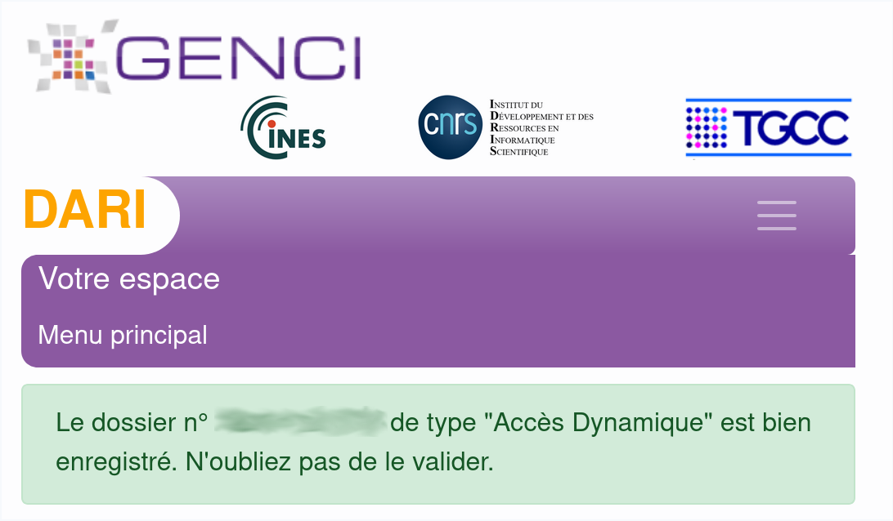
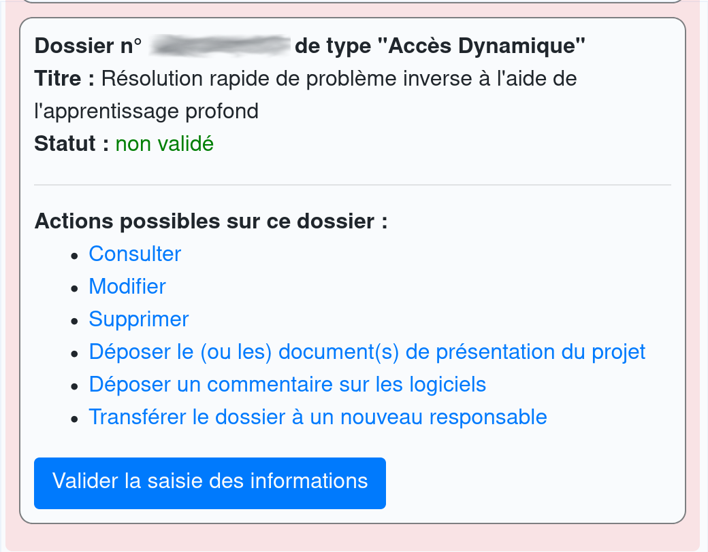
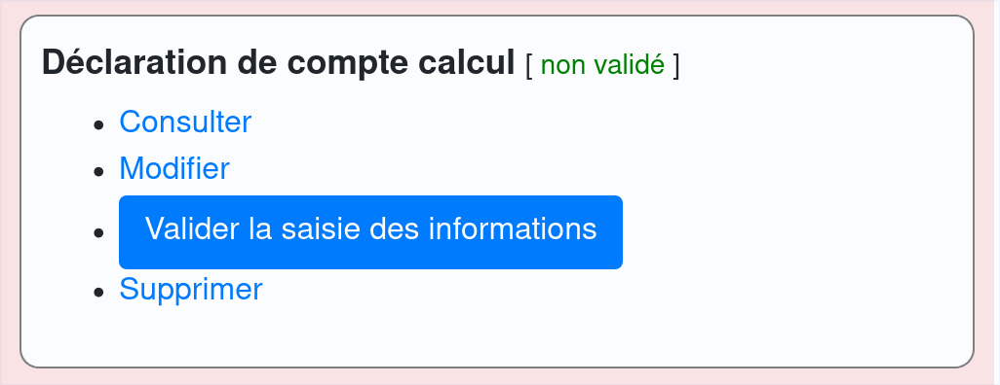

# Access procedure for Jean Zay

Our experience is that the access procedure for Jean Zay takes roughly 3
weeks (add 1-2 months on top of that if you are not French for background
security checks). It does seem long but it is definitely worth it.

!!! tip
    Find people that have accessed IDRIS or GENCI clusters around you. If you
    have no idea who they may be, your local IT may know, ask them. They may
    save you a lot of time, because they have gone through a similar procedure.

## Overview of the procedure

Here we will focus on the easiest procedure to access Jean Zay, namely the
"Accès dynamique" one. This procedure only applies if your research is around
developing AI algorithms. Here is a quick overview of the procedure. Each step
is detailed in the sections below.

1. Create an [EDARI account](https://www.edari.fr/sp/login) (simple
   personal details). See [this](#edari-account-administrative-account)
   for all the details about this step.
2. Fill a form about your project (**"Déclaration de dossier"**). Hardest part
   is to figure out who your "Directeur de la structure de recherche" is and to
   have the form signed by him/her. You also need to write a few lines about
   your project. See [this](#d%C3%A9claration-de-dossier-project-description)
   for all the details about this step.
3. Fill a form about to get a computing account (**"Déclaration de compte
   calcul"**). Hardest part is to figure out who your "Responsable Sécurité
   informatique" is and have the form signed by him/her as well as the
   "Directeur de la structure de recherche". You also need to declare one (or
   more) IP address(es) that will be able to use to connect to Jean Zay. See
   [this](#d%C3%A9claration-de-compte-calcul-computing-account-creation-for-jean-zay)
   for all the details about this step.
4. After roughly a week, you'll get an email from IDRIS giving you your login,
   password and instructions to connect to Jean Zay. See
   [this](#idris-email-with-login-and-password) for all the details about this
   step.
5. After roughly 2 days, you should be able to connect to Jean Zay.

## EDARI account (administrative account)

!!! info "Estimate of the time needed:"
    5 minutes.

To create an EDARI account:
[https://www.edari.fr/sp/login](https://www.edari.fr/sp/login) (for a wide
range of academic institutions through RENATER) or
[https://www.edari.fr/user/register](https://www.edari.fr/user/register) (if
you can not find your institution in the first link).

In case something goes wrong:

- Contact for [EDARI account](https://www.edari.fr/contact)
- [EDARI FAQ](https://www.edari.fr/faq)

!!! warning
    When filling your phone number, use a real one. Yes, you may get a call to
    have a better idea what you want to do ...

## "Déclaration de dossier" (project description)

!!! info "Estimate of the time needed:"
    15 minutes (fill the form) + 1-2 days (figure out the right person to sign
    the form and get him/her to sign it).

On your [EDARI user space](https://www.edari.fr/utilisateur), click on the
"Intelligence Artificielle" section and then "Déclaration de dossier" and then
"Constituer un dossier".
  
!!! note "Important details:"
    - "Directeur de la structure de recherche" : head of the lab, head of the
      department, head of the institute, do what is easier for you.
    - As long as you ask for <= 10000 GPU hours (~400 days on a single GPU) and
      less than 48 GPUs simultaneously (4 GPUs on 12 nodes) it should go through
      easily (see https://www.edari.fr/voirlappel56).
    - Project description : no need to spend too much time on this, 3-5 lines
      should be plenty enough if you ask for less than 10000 GPU hours.

When you finish filling out this part, you should something like this:

!!! warning "Important"
    You need to click on "Valider la saisie des informations" to validate your
    information:

Note that in principle once your 10000 GPU hours are exhausted you can ask for
a renewal through a similar "lightweight" procedure.

## "Déclaration de compte calcul" (computing account creation for Jean Zay)

!!! info "Estimate of the time needed:"
    15 minutes (fill the form) + 1-2 days (figure out the right person to sign
    the form and get him/her to sign it).

!!! note "Important details:"
    - "Responsable sécurité informatique", this is someone that should be able
      to turn deny you access to Jean Zay, in case there is any issue with your
      account activity. He/She must be able to certify that you respect the IT
      charter in your host lab/institution. In CNRS labs, he/she is known as
      the CSSI (Chargé·e de la Sécurité des Systèmes Informatiques).
    - IP addresses to connect to Jean Zay. Make sure they are static IP
      addresses (e.g. not your IP address from you home). In most cases: your
      desktop in your lab will have a static IP address, but best confirm with
      your local IT people. Note that the form is helping you with some
      suggestion which were correct when filling it from a fixed desktop in our
      lab.

When you finish filling out this part, you should see something like this:

!!! warning "Important"
    You need to click on "Valider la saisie des informations" to
    validate your information:

## Optional (skip this if you are French)

The direction of IDRIS will most likely require an additional security
authorization. You will have to fill a form with basic information about
yourself (name, address, date and place of birth) and about the project you
will be working on: where you will be working from, where your financing comes
from (e.g. Inria, a project grant, etc ...), and a description of your project.

The project description comes in two parts:

- A short description (can be the same as the one used in your declaration on
  Edari) embedded in the form you will receive.
- A more detailed description to attach in PDF. A one-page file with half
  description / half bibliography should be enough. You will also be asked to
  attach a CV. It must include everything you did after you obtained your last
  degree. Every blank should be explicitly stated. For example, if you had a
  one month break, you should specify this month on your CV and state « No
  employment » next to it.

After everything is submitted, you should receive an e-mail saying it will take
between 1 and 2 months (In practice it took 2.5 months). Do not hesitate to
send them an email if you don't hear from them maybe after 1 month the first
time, and then every two weeks until you manage to get through the security
background checks (fix this part if you have better recommendations).

Once this step is complete, the regular procedure applies.

## IDRIS email with login and password

In principle, you should receive a "Ouverture de votre compte" email from IDRIS
roughly one week after having completed the previous step. Contact:
[assist@idris.fr](mailto:assist@idris.fr) if you have not received email within
a week.

- Quite a long email with detailed instructions. One the first connection your
  password is the concatenation of the first password in "Déclaration de compte
  calcul" and the password in the email. You are then asked to chose a new
  password.
- Count 2-3 days after the email to actually be able to access Jean Zay. Some
  time is needed for the IP address to be added to Jean Zay.

## How to add additionnal IP addresses to your authorised IP addresses

!!! info "Estimate of the time needed:"
    15 minutes (fill the form) + 1-2 days (figure out the right person to sign
    the form and get him/her to sign it). + 1-2 days (until the change actually
    takes effect on the IDRIS side).

To add additionnal IP addresses to those mentioned on your original declaration:

- Fill the "Ajout, modification ou suppression de machines" table on page 2 of§
  [this pdf
  document](http://www.idris.fr/media/data/formulaires/fgc.pdf#page=2).
- Have it signed by your "Responsable sécurité informatique".
- e-mail the signed form to gestutil@idris.fr and wait 1-2 days until the change
  actually takes effect.

# How to write a project proposal (only needed if you request more than 10k GPU
hours)

!!! info "Estimate of the time needed:"
    1h (write a project) + a few days/weeks for approval (depending on the
    request). 

Useful when you have used most of your computing time and want to fill a
"Demande de ressources au fil de l'eau" (request more hours on the fly), and
you would like to ask for more than 10k GPU hours.

- Describe the scientific project for which you need to perform experiments. Be
  specific about the team you work in, why do you need such computing
  ressources
- Estimate the number of hours you will need. To provide an estimate you can
  estimate your daily/weekly computing time `C` you need and multiply by the
  number of months `M` you want to work on Jean-Zay for this project to get
  `T = C * M`.
- Describe a typical experiment. How much computing ressources do you need: do
  you use 1 GPU per experiment or 10 GPUs, if 10 why, can be useful to justify
  your daily need of computation `C`. Be specific about the algorithms you are
  using, the data type (image, text, audio, video ...), the model you use (cnn,
  lstm, kernels, ...) and what your model is used for (predicting image labels,
  pose estimation, robot movements, ...)
- Include references to back up your project. If you already have published, it
  is definitely a plus.

Depending on your request, this proposal can be reviewed by 1 to 10 people.
